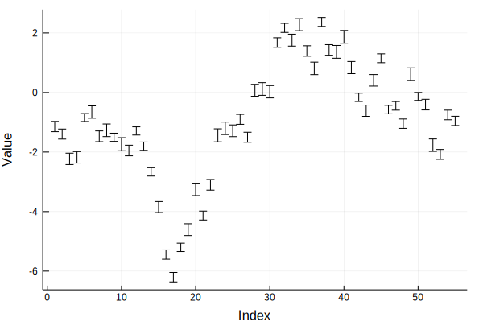

`UncertainDataset`s is a generic uncertain dataset type that has no explicit index 
associated with its uncertain values.

It inherits all the behaviour of `AbstractUncertainValueDataset`, but may lack some 
functionality that an [UncertainValueDataset](uncertain_value_dataset.md) has.

If you don't care about distinguishing between 
indices and data values, constructing instances of this data type requires five less key 
presses than [UncertainValueDataset](uncertain_value_dataset.md).

## Documentation

```@docs
UncertainDataset
```

## Defining an `UncertainDataset` from a collection of uncertain values

Let's create a random walk and pretend it represents fluctuations in the mean
of an observed dataset. Assume that each data point is normally distributed,
and that the $i$-th observation has standard deviation $\sigma_i \in [0.3, 0.5]$.

Representing these data as an `UncertainDataset` is done as follows:

```julia
using UncertainData, Plots

# Create a random walk of 55 steps
n = 55
rw = cumsum(rand(Normal(), n))

# Represent each value of the random walk as an uncertain value and
# collect them in an UncertainDataset
dist = Uniform(0.3, 0.5)
uncertainvals = [UncertainValue(Normal, rw[i], rand(dist)) for i = 1:n]
D = UncertainDataset(uncertainvals)
```

By default, plotting the dataset will plot the median values (only for scatter plots) along with the 33rd to 67th
percentile range error bars.

```julia
plot(D)
```



You can customize the error bars by explicitly providing the quantiles:

```julia
plot(D, [0.05, 0.95])
```


## Example 2: mixing different types of uncertain values

Mixing different types of uncertain values also works. Let's create a dataset
of uncertain values constructed in different ways.

```julia
using UncertainData, Distributions, Plots

# Theoretical distributions
o1 = UncertainValue(Normal, 0, 0.5)
o2 = UncertainValue(Normal, 2, 0.3)
o3 = UncertainValue(Uniform, 0, 4)

# Theoretical distributions fitted to data
o4 = UncertainValue(Uniform, rand(Uniform(), 100))
o5 = UncertainValue(Gamma, rand(Gamma(2, 3), 5000))

# Kernel density estimated distributions for some more complex data.
M1 = MixtureModel([Normal(-5, 0.5), Gamma(2, 5), Normal(12, 0.2)])
M2 = MixtureModel([Normal(-2, 0.1), Normal(1, 0.2)])
o6 = UncertainValue(rand(M1, 1000))
o7 = UncertainValue(rand(M2, 1000))

D = UncertainDataset([o1, o2, o3, o4, o5, o6, o7])
```

Now, plot the uncertain dataset.

```julia
using Plots
# Initialise the plot
p = plot(legend = false, xlabel = "time step", ylabel = "value")

# Plot the mean of the dataset
plot!([median(D[i]) for i = 1:length(D)], label = "mean", lc = :blue, lw = 3)

for i = 1:200
    plot!(p, resample(D), lw = 0.4, lα = 0.1, lc = :black)
end

p
```


