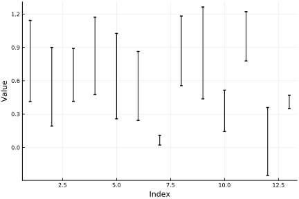
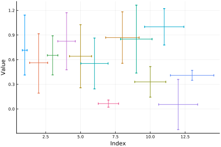

# Uncertain index-value datasets

## Documentation

```@docs
UncertainIndexValueDataset
```

## Description

`UncertainIndexValueDataset`s have uncertainties associated with both the 
indices (e.g. time, depth, etc) and the values of the data points.

## Defining an uncertain index-value dataset

### Example 1

#### Defining the values

Let's start by defining the uncertain data values and collecting them in 
an `UncertainValueDataset`.

```julia
using UncertainData, Plots 
gr()
r1 = [UncertainValue(Normal, rand(), rand()) for i = 1:10]
r2 = UncertainValue(rand(10000))
r3 = UncertainValue(Uniform, rand(10000))
r4 = UncertainValue(Normal, -0.1, 0.5)
r5 = UncertainValue(Gamma, 0.4, 0.8)

u_values = [r1; r2; r3; r4; r5]
udata = UncertainValueDataset(u_values);
```

#### Defining the indices

The values were measures at some time indices by an inaccurate clock, so that the times 
of measuring are normally distributed values with fluctuating standard deviations.

```julia
u_timeindices = [UncertainValue(Normal, i, rand(Uniform(0, 1))) 
    for i = 1:length(udata)]
uindices = UncertainIndexDataset(u_timeindices);
```

#### Combinining the indices and values

Now, combine the uncertain time indices and measurements into an 
`UncertainIndexValueDataset`.

```julia
x = UncertainIndexValueDataset(uindices, udata)
```

The built-in plot recipes make it easy to visualize the dataset. 
By default, plotting the dataset plots the median value of the index and the measurement 
(only for scatter plots), along with the 33rd to 67th percentile range error bars in both 
directions.

```julia
plot(x)
```


You can also tune the error bars by calling 
`plot(udata::UncertainIndexValueDataset, idx_quantiles, val_quantiles)`, explicitly 
specifying the quantiles in each direction, like so:

```julia
plot(x, [0.05, 0.95], [0.05, 0.95])
```


### Example 2

#### Defining the indices

Say we had a dataset of 20 values for which the uncertainties are normally distributed 
with increasing standard deviation through time.

```julia
time_inds = 1:13
uvals = [UncertainValue(Normal, ind, rand(Uniform()) + (ind / 6)) for ind in time_inds]
inds = UncertainIndexDataset(uvals)
```

That's it. We can also plot the 33rd to 67th percentile range for the indices.

```plot
plot(inds, [0.33, 0.67])
```


#### Defining the values

Let's define some uncertain values that are associated with the indices.

```julia
u1 = UncertainValue(Gamma, rand(Gamma(), 500))
u2 = UncertainValue(rand(MixtureModel([Normal(1, 0.3), Normal(0.1, 0.1)]), 500))
uvals3 = [UncertainValue(Normal, rand(), rand()) for i = 1:11]

measurements = [u1; u2; uvals3]
datavals = UncertainValueDataset(measurements)
```



#### Combinining the indices and values

Now, we combine the indices and the corresponding data.

```julia
d = UncertainIndexValueDataset(inds, datavals)
```

Plot the dataset with error bars in both directions, using the 20th to 80th percentile 
range for the indices and the 33rd to 67th percentile range for the data values. 

```julia
plot(d, [0.2, 0.8], [0.33, 0.67])
```


