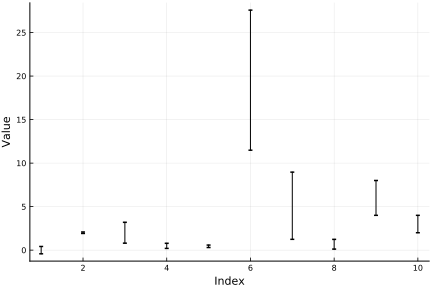

# Uncertain value datasets

## Documentation

```@docs
UncertainValueDataset
```

## Description

`UncertainValueDataset`s is an uncertain dataset type that has no explicit index 
associated with its uncertain values. This type may come with some extra functionality 
that the generic [UncertainDataset](uncertain_dataset.md) type does not support. 

Use this type when you want to be explicit about the values representing data values,
as opposed to [indices](uncertain_index_dataset.md). 

## Defining uncertain value datasets

### Example 1: constructing an `UncertainValueDataset` from uncertain values

Let's create a random walk and pretend it represents fluctuations in the mean
of an observed dataset. Assume that each data point is normally distributed,
and that the $i$-th observation has standard deviation $\sigma_i \in [0.3, 0.5]$.

Representing these data as an `UncertainValueDataset` is done as follows:

```julia 
o1 = UncertainValue(Normal, 0, 0.5)
o2 = UncertainValue(Normal, 2.0, 0.1)
o3 = UncertainValue(Uniform, 0, 4)
o4 = UncertainValue(Uniform, rand(100))
o5 = UncertainValue(Beta, 4, 5)
o6 = UncertainValue(Gamma, 4, 5)
o7 = UncertainValue(Frechet, 1, 2)
o8 = UncertainValue(BetaPrime, 1, 2)
o9 = UncertainValue(BetaBinomial, 10, 3, 2)
o10 = UncertainValue(Binomial, 10, 0.3)

uvals = [o1, o2, o3, o4, o5, o6, o7, o8, o9, o10]
d = UncertainValueDataset(uvals)
```

The built-in plot recipes makes it a breeze to plot the dataset. Here, we'll plot the 
20th to 80th percentile range error bars. 

```julia
plot(d, [0.2, 0.8])
```


