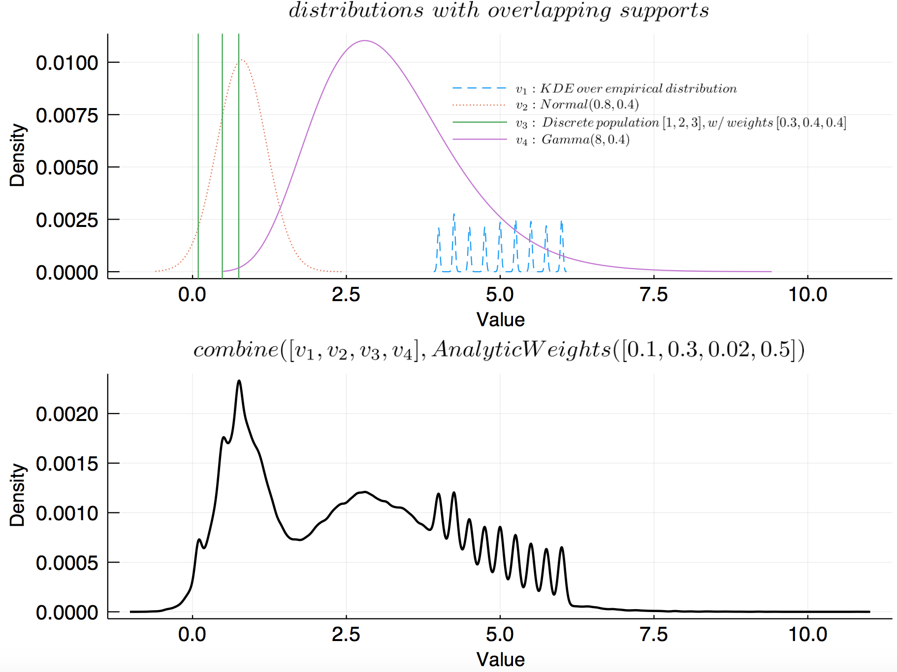
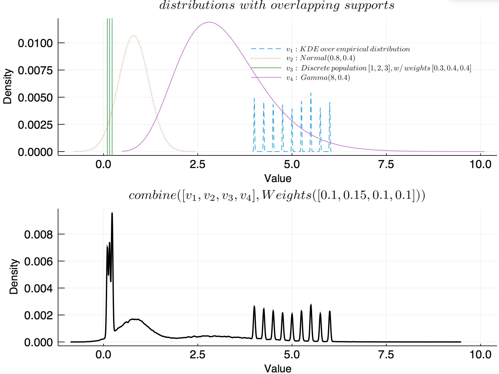
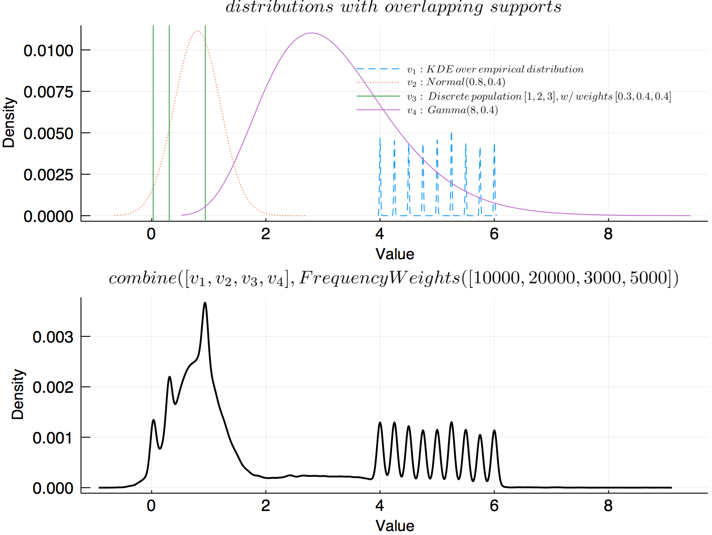

Because all uncertainties are handled using a resampling approach, it is trivial to 
[`combine`](@ref) uncertain values of different types into a single 
uncertain value. 

# Without weights 

When no weights are provided, the combined value is computed 
by resampling each of the `N` uncertain values `n/N` times,
then combining using kernel density estimation. 

```@docs
combine(uvals::Vector{AbstractUncertainValue}; n = 1000*length(uvals), 
        bw::Union{Nothing, Real} = nothing)
```

Weights dictating the relative contribution of each 
uncertain value into the combined value can also be provided. `combine` works 
with `ProbabilityWeights`, `AnalyticWeights`, 
`FrequencyWeights` and the generic `Weights`. 

Below shows an example of combining 

```julia
v1 = UncertainValue(rand(1000))
v2 = UncertainValue(Normal, 0.8, 0.4)
v3 = UncertainValue([rand() for i = 1:3], [0.3, 0.3, 0.4])
v4 = UncertainValue(Normal, 3.7, 0.8)
uvals = [v1, v2, v3, v4]

p = plot(title = L"distributions \,\, with \,\, overlapping \,\, supports")
plot!(v1, label = L"v_1", ls = :dash)
plot!(v2, label = L"v_2", ls = :dot)
vline!(v3.values, label = L"v_3") # plot each possible state as vline
plot!(v4, label = L"v_4")

pcombined = plot(combine(uvals), title = L"merge(v_1, v_2, v_3, v_4)", lc = :black, lw = 2)

plot(p, pcombined, layout = (2, 1), link = :x, ylabel = "Density")
```


# With weights 

`Weights`, `ProbabilityWeights` and  `AnalyticWeights` are functionally the same. Either 
may be used depending on whether the weights are assigned subjectively or quantitatively. 
With `FrequencyWeights`, it is possible to control the exact number of draws from each 
uncertain value that goes into the draw pool before performing KDE.

## ProbabilityWeights


```@docs
combine(uvals::Vector{AbstractUncertainValue}, weights::ProbabilityWeights; 
    n = 1000*length(uvals))
```

For example: 

```julia 
v1 = UncertainValue(UnivariateKDE, rand(4:0.25:6, 1000), bandwidth = 0.02)
v2 = UncertainValue(Normal, 0.8, 0.4)
v3 = UncertainValue([rand() for i = 1:3], [0.3, 0.3, 0.4])
v4 = UncertainValue(Gamma, 8, 0.4)
uvals = [v1, v2, v3, v4];

p = plot(title = L"distributions \,\, with \,\, overlapping \,\, supports")
plot!(v1, label = L"v_1: KDE \, over \, empirical \, distribution", ls = :dash)
plot!(v2, label = L"v_2: Normal(0.8, 0.4)", ls = :dot)
# plot each possible state as vline
vline!(v3.values, 
    label = L"v_3: \, Discrete \, population\, [1,2,3], w/ \, weights \, [0.3, 0.4, 0.4]") 
plot!(v4, label = L"v_4: \, Gamma(8, 0.4)")

pcombined = plot(
    combine(uvals, ProbabilityWeights([0.1, 0.3, 0.02, 0.5]), n = 100000, bw = 0.05), 
    title = L"combine([v_1, v_2, v_3, v_4], ProbabilityWeights([0.1, 0.3, 0.02, 0.5])", 
    lc = :black, lw = 2)

plot(p, pcombined, layout = (2, 1), size = (800, 600), 
    link = :x, 
    ylabel = "Density",
    tickfont = font(12),
    legendfont = font(8), fg_legend = :transparent, bg_legend = :transparent)
```


## AnalyticWeights

```@docs
combine(uvals::Vector{AbstractUncertainValue}, weights::AnalyticWeights; 
    n = 1000*length(uvals))
```

For example:

```julia 
v1 = UncertainValue(UnivariateKDE, rand(4:0.25:6, 1000), bandwidth = 0.02)
v2 = UncertainValue(Normal, 0.8, 0.4)
v3 = UncertainValue([rand() for i = 1:3], [0.3, 0.3, 0.4])
v4 = UncertainValue(Gamma, 8, 0.4)
uvals = [v1, v2, v3, v4];

p = plot(title = L"distributions \,\, with \,\, overlapping \,\, supports")
plot!(v1, label = L"v_1: KDE \, over \, empirical \, distribution", ls = :dash)
plot!(v2, label = L"v_2: Normal(0.8, 0.4)", ls = :dot)
vline!(v3.values, label = L"v_3: \, Discrete \, population\, [1,2,3], w/ \, weights \, [0.3, 0.4, 0.4]") # plot each possible state as vline
plot!(v4, label = L"v_4: \, Gamma(8, 0.4)")

pcombined = plot(combine(uvals, AnalyticWeights([0.1, 0.3, 0.02, 0.5]), n = 100000, bw = 0.05), 
    title = L"combine([v_1, v_2, v_3, v_4], AnalyticWeights([0.1, 0.3, 0.02, 0.5])", lc = :black, lw = 2)

plot(p, pcombined, layout = (2, 1), size = (800, 600), 
    link = :x, 
    ylabel = "Density",
    tickfont = font(12),
    legendfont = font(8), fg_legend = :transparent, bg_legend = :transparent)
```




## Generic Weights


```@docs
combine(uvals::Vector{AbstractUncertainValue}, weights::Weights; 
    n = 1000*length(uvals))
```

For example: 

```julia
v1 = UncertainValue(UnivariateKDE, rand(4:0.25:6, 1000), bandwidth = 0.01)
v2 = UncertainValue(Normal, 0.8, 0.4)
v3 = UncertainValue([rand() for i = 1:3], [0.3, 0.3, 0.4])
v4 = UncertainValue(Gamma, 8, 0.4)
uvals = [v1, v2, v3, v4];

p = plot(title = L"distributions \,\, with \,\, overlapping \,\, supports")
plot!(v1, label = L"v_1: KDE \, over \, empirical \, distribution", ls = :dash)
plot!(v2, label = L"v_2: Normal(0.8, 0.4)", ls = :dot)
# plot each possible state as vline
vline!(v3.values, 
    label = L"v_3: \, Discrete \, population\, [1,2,3], w/ \, weights \, [0.3, 0.4, 0.4]") 
plot!(v4, label = L"v_4: \, Gamma(8, 0.4)")

pcombined = plot(combine(uvals, Weights([0.1, 0.15, 0.1, 0.1]), n = 100000, bw = 0.02), 
    title = L"combine([v_1, v_2, v_3, v_4],  Weights([0.1, 0.15, 0.1, 0.1]))", 
    lc = :black, lw = 2)

plot(p, pcombined, layout = (2, 1), size = (800, 600), 
    link = :x, 
    ylabel = "Density",
    tickfont = font(12),
    legendfont = font(8), fg_legend = :transparent, bg_legend = :transparent)
```




## FrequencyWeights

Using `FrequencyWeights`, one may specify the number of times each of the uncertain values 
should be sampled to form the pooled resampled draws on which the final kernel density 
estimate is performed.

```@docs
combine(uvals::Vector{AbstractUncertainValue}, weights::FrequencyWeights; 
    n = 1000*length(uvals))
```

For example: 

```julia
v1 = UncertainValue(UnivariateKDE, rand(4:0.25:6, 1000), bandwidth = 0.01)
v2 = UncertainValue(Normal, 0.8, 0.4)
v3 = UncertainValue([rand() for i = 1:3], [0.3, 0.3, 0.4])
v4 = UncertainValue(Gamma, 8, 0.4)
uvals = [v1, v2, v3, v4];

p = plot(title = L"distributions \,\, with \,\, overlapping \,\, supports")
plot!(v1, label = L"v_1: KDE \, over \, empirical \, distribution", ls = :dash)
plot!(v2, label = L"v_2: Normal(0.8, 0.4)", ls = :dot)
# plot each possible state as vline
vline!(v3.values, 
    label = L"v_3: \, Discrete \, population\, [1,2,3], w/ \, weights \, [0.3, 0.4, 0.4]") 
plot!(v4, label = L"v_4: \, Gamma(8, 0.4)")

pcombined = plot(combine(uvals, FrequencyWeights([10000, 20000, 3000, 5000]), bw = 0.05), 
    title = L"combine([v_1, v_2, v_3, v_4], FrequencyWeights([10000, 20000, 3000, 5000])", 
    lc = :black, lw = 2)

plot(p, pcombined, layout = (2, 1), size = (800, 600), 
    link = :x, 
    ylabel = "Density",
    tickfont = font(12),
    legendfont = font(8), fg_legend = :transparent, bg_legend = :transparent)
```



